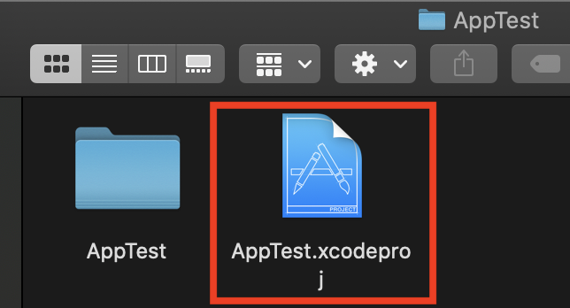
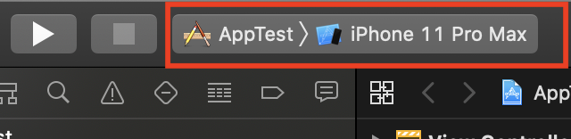
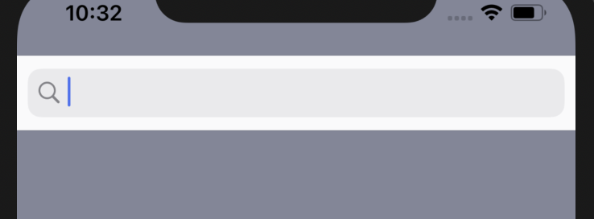

## This project is used to try to click the button to connect to the next interface.

_The link to download the XCode/Swift_

https://swift.org/download/#releases

### Steps to install XCode (For macOS-Catalina version 10.15.4)

1. Download the latest version of XCode 11.4.1
   From: https://swift.org/download/#releases
   or from App Store
2. Follow the steps to install the XCode into application
3. Create a new folder
4. Open your terminal -> go the the folder
5. using command to clone the project: ```git clone git@github.com:jq5/MISL-SOC-20-Tingting.git```
6. After clone, open the folder name "ProjectDemo"
7. Below to explain how to run project "AppTest"

### Steps to run XCode project

1. Open ***AppTest.xcodeproj*** as image below. XCode then will open the project.


2.  On the top left corner, select ***iPhone 11 Pro Max***, then click the run button.


3. At the top of the main page, there is a search bar.


4. There are four buttons on the homepage to connect to the next interface.(Take ***Diary*** as an example)


