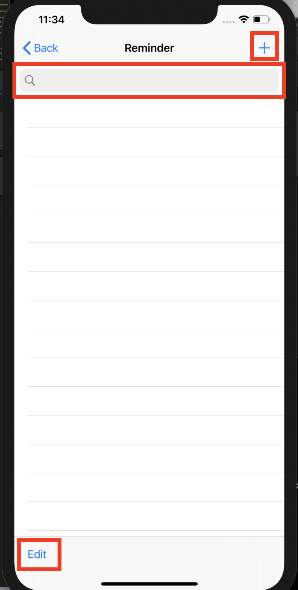
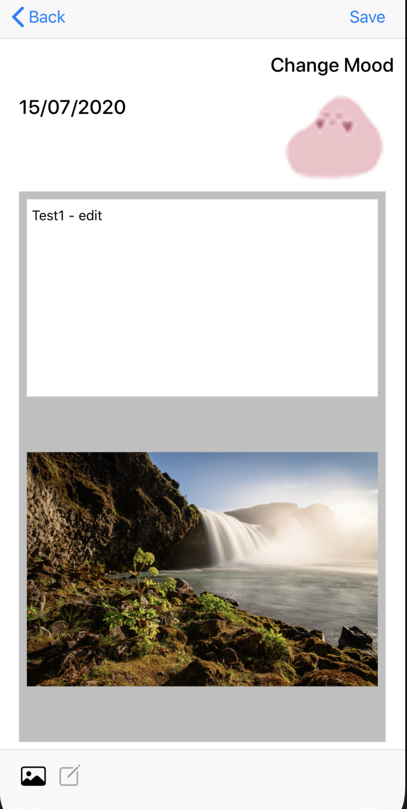

## Myproject: 

### The project is combining the functions of Reminder, Diary and List. Since all these things are separate apps on mobile phones at present, my idea is that they can be grouped together to make it more convenient for users to use. This can be used by anyone who needs it.

_The link to download the XCode/Swift_

https://swift.org/download/#releases

### Steps to install XCode (For macOS-Catalina version 10.15.4)

1. Download the latest version of XCode
   From: https://swift.org/download/#releases
   or from App Store
2. Follow the steps to install the XCode into application
3. Create a new folder
4. Open your terminal -> go the the folder
5. using command to clone the project: ```git clone git@github.com:jq5/MISL-SOC-20-Tingting.git```
6. After clone, open the folder name "MyProject"
7. Below explain how to run this project

### Steps to run Reminder

1. Open ***MyProject.xcworkspace*** as image below. XCode then will open the project. (Make sure open the **Xcode workspace** instead of the project file when building your project)


2.  On the top left corner, select ***iPhone 11 Pro Max***, then click the run button. (Make sure you choose **MyProject** next **Run** button as the image below)


3. Wait until the simulator pop up, it might take few minutes, then you can see the homepage, click the Reminder button on the page.


4. There is a **search bar** at the top of the Reminder main page, and you can search according to the input.

5. There is an **Edit** icon in the lower left corner of the Reminder homepage, which allows you to make batch changes or select multiple items to delete.

6. In the upper right corner is the **+** button to add a new reminder. Click on it to enter the interface to add a new event.


7. On the add event page, it has *title*, *notes* and *time* as image shown below, you can have a try to edit all of them.


8. Back to the homepage, it shows all the events as image below. 


9. Swipe the events to the left and can choose to delete it, can also click the Edit button to delete.


10. Click the added events on the homepage to enter the interface to shown events details.

11. There is an **edit** icon in the upper right corner of the details page, click it to enter the interface to edit events.


12. In the editing page can also has *title*, *notes* and *time*. Click **save** to jump back to the details page.


13. You can receive the notification at the time you set.


### Steps to run Diary

1. Click the Diary button on the homepage. 


2. If it doesn't work or no calendar on the diary homepage or have error message such as no such module FSCalendar, open the terminal and follow the steps as below or check on this website https://cocoapods.org to install CocoaPods for running the calendar in the project.
    
    - Open terminal on your device and go to the folder where the MyProject belongs
    - Install Cocoapods : $ sudo gem install cocoapods
    - Install the dependencies in project, make sure you inside **“MyProject”** project folder before running this: $ pod install
    - Make sure to always open the **“Xcode workspace”** instead of the project file when building project: $ open MyProject.xcworkspace

3. In normal operation, the page displays the date of the current month. Click any date to add diary, you can choose to change the mood, add content and add pictures, click save to jump back to the calendar interface. 


(The Calendar page can not be refreshed automatically, need to back to the homepage to refresh it after you add diary) 


4. Click the date with an expression (that is, the date of the added diary) to jump to the diary details interface. Display content, photos and mood. Click trash below to delete, click text icon will jump to the edit interface.  (The Calendar page can not be refreshed automatically, need to back to the homepage to refresh it after you deletes diary) 



5. You can modify the content, picture and mood in the editing interface. After modification, click Save to jump back to the details interface. (The Calendar page can not be refreshed automatically, need to back to the homepage to refresh it after you edit diary) 


### Future Work

1. Add the cancel and edit functions on the Reminder home page **(Solved)**
2. Advance notification function in Reminder **(Solved)**
3. Update CoreData for Reminder **(Solved)**
4. Improve Reminder interface     (0.5 - 1 week)
5. Improve the diary interface     (0.5 - 1 week)
6. Realize **Diary** functions - e.g. Add image function, input text function    **(Solved)**
7. Improve Diary, test and fix bugs     **(Solved)**
8. Improve MyProject interface     (0.5 - 1 week)

### Reference

1. When making the Reminder, the edited content cannot be displayed in the details screen after editing. **(Solved)**

Solution: 

https://stackoverflow.com/questions/24038215/how-to-navigate-from-one-view-controller-to-another-using-swift

2. Implement Calendar in Diary homepage

http://cocoadocs.org/docsets/FSCalendar/0.9.0/

