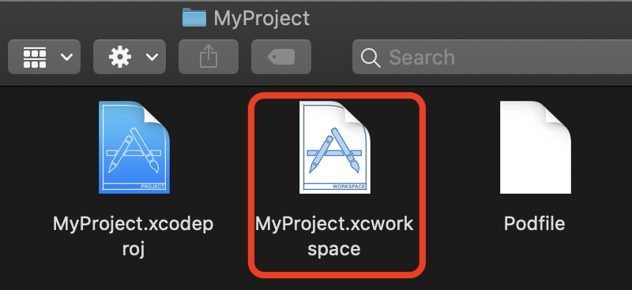
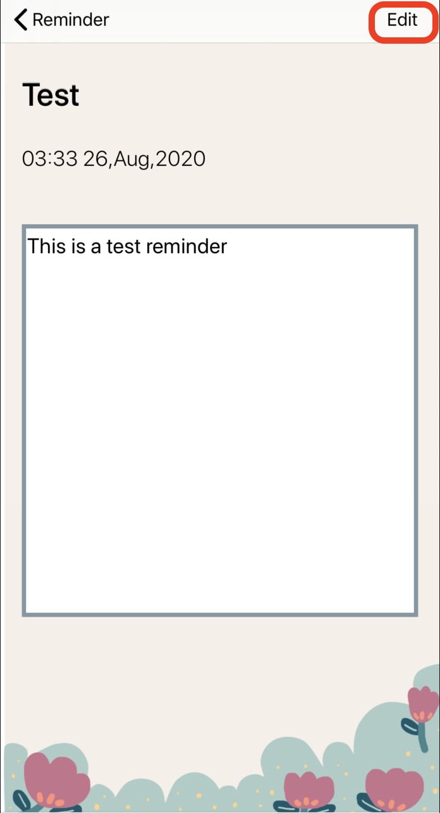

## Myproject: 

### The project is combining the functions of Reminder, Diary and List. Since all these things are separate apps on mobile phones at present, my idea is that they can be grouped together to make it more convenient for users to use. This can be used by anyone who needs it.

## Below will show how to use this application

### Before running this application, follow the steps as below to ensure that the calendar function in the application is working properly.
---

Open the terminal and follow the steps as below or check on this website https://cocoapods.org to install CocoaPods for running the calendar in the project.

- Open terminal on your device and go to the folder where the MyProject belongs
- Install Cocoapods : $ sudo gem install cocoapods
- Install the dependencies in project, make sure you inside **“MyProject”** project folder before running this: $ pod install
- Make sure to always open the **“Xcode workspace”** instead of the project file when building project: $ open MyProject.xcworkspace

### Steps to run Reminder
---

1. Open ***MyProject.xcworkspace*** as image below. XCode then will open the project. (Make sure open the **Xcode workspace** instead of the project file when building your project)

2.  On the top left corner, select ***iPhone 11 Pro Max***, then click the run button. (Make sure you choose **MyProject** next **Run** button as the image below)

3. Wait until the simulator pop up, it might take few minutes, then you can see the application homepage, click the ***Remind*** button on the page, it will jump to the Reminder main page.

4. There is a ***search bar*** at the top of the Reminder main page, and you can search according to the input.

5. There is an ***Edit*** icon in the lower left corner of the Reminder homepage, which allows you to make batch changes or select multiple items to delete.

6. In the upper right corner is the ***+*** button to add a new reminder. Click on it to enter the interface to add a new event.

7. On the add event page, it has **title**, **notes** and **time** as image shown below, you can have a try to edit all of them. If an item is missing, a prompt appears when you click ***Save*** button.

8. Go back to the Reminder main page, which displays all the events you added. There are two ways to delete events: 1. Swipe the events to the left and can choose to delete it  2. Click the Edit button to delete it.

9. Click the added events on the Reminder main page to enter the interface to shown events details.

10. There is an ***edit*** icon in the upper right corner of the details page, click it to enter the interface to edit events.

11. In the editing page can also has **title**, **notes** and **time**. Click ***save*** to jump back to the details page.

12. You can receive the notification at the time you set.

### Steps to run Diary
---

1. Click the Diary button on the application homepage, it will jump to Diary main page.

2. In normal operation, the Diary main page displays the date of the current month. Click any date to add diary, you can choose to change the **mood**, **add content** and **add pictures**, click ***save*** to jump back to the calendar interface. 

(The Calendar page can not be refreshed automatically, need to back to the homepage to refresh it after you add diary) 

4. Click the date with an expression (that is, the date of the added diary) to jump to the Diary details interface. Display **content**, **photos** and **mood**. Click ***trash*** below to delete, click ***text*** icon will jump to the edit interface.  (The Calendar page can not be refreshed automatically, need to back to the homepage to refresh it after you deletes diary) 

5. You can modify the **content**, **picture** and **mood** in the editing interface. After modification, click ***Save*** to jump back to the details interface. (The Calendar page can not be refreshed automatically, need to back to the homepage to refresh it after you edit diary) 

### Steps to run List
---

1. Click the List button on the homepage, it will jump to List main page.

2. The main page of List has three buttons: ***To-Do List***, ***Habit***, ***Travel List***. Click to enter the Homepage of corresponding function.

3. Click ***To-Do List*** button to jump to its home page. You can enter any backlog items in the **input box** at the top. Click ***Add*** on the right to see this item at the bottom, and click this item to delete it, indicating that the item has been completed.

4. Click ***Habit*** button to jump to its home page. Click the ***Add*** button on the right to jump to the interface of adding new Habit. The search bar on the top can display the previously added search of Habit, and the bottom can display all the added habits. It is assumed that the 90-day cycle of habit-building is completed, and clicking every day reduces the number of clicks by one day, and can only be clicked once a day.

5. In the add interface to Habit, you need to type **Title**, **Duration** and **Persistence**. If an item is missing, a prompt appears when you click ***add***. At the same time, you can choose whether to need a reminder function in the bottom. Click to receive a reminder at 8:00 a.m. every day. 

6. Click ***Travel List*** button to jump to its home page.  Click **Checklist** to display the list of travel documents and articles required for travel. Click **Add Place You Want To Go** to jump to the add place interface.

7. In the add places page, you can add **where you want to go(location)**, **budget**, **reason** and **date**. A prompt is displayed if location is missing. Click ***Save*** to return to travel home page. The information just added is displayed at the bottom of the home page. Click it to view and edit. 

### Future Work

1. Add the cancel and edit functions on the Reminder home page **(Solved)**
2. Advance notification function in Reminder **(Solved)**
3. Update CoreData for Reminder **(Solved)**
4. Realize **Diary** functions - e.g. Add image function, input text function    **(Solved)**
5. Improve Diary, test and fix bugs     **(Solved)**
6. Realize **List** functions - e.g. To-Do List, Habit, Travel List     **(Solved)**
7. Improve List, test and fix bugs     **(Solved)**
8. Improve MyProject interface     **(Solved)**

### Reference

1. When making the Reminder, the edited content cannot be displayed in the details screen after editing. **(Solved)**

Solution: 

https://stackoverflow.com/questions/24038215/how-to-navigate-from-one-view-controller-to-another-using-swift

2. Implement Calendar in Diary homepage

http://cocoadocs.org/docsets/FSCalendar/0.9.0/

