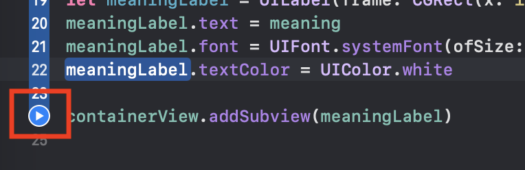

_The link to download the XCode/Swift_

https://swift.org/download/#releases

### Steps to install XCode (For macOS-Catalina version 10.15.4)

1. Download the latest version of XCode 11.4.1
From: https://swift.org/download/#releases
or from App Store
2. Follow the steps to install the XCode into application
3. Create a new folder
4. Open your terminal -> go the the folder
5. using command to clone the project: ```git clone git@github.com:jq5/MISL-SOC-20-Tingting.git```
6. After clone, open the folder name "Exercise - Exercise_Playground"

### Steps to run XCode playground

Below will use playground "Emoji" as an example to explain how to run a playground.

1. Open ***Emoji.playground*** as image below. XCode then will open the playground.


2. Click and run the playground.


### Reference

1. https://www.appcoda.com/learnswift/ 
2. https://www.youtube.com/user/CodeWithChris
3. https://codewithchris.com/swift-tutorial/
4. https://codewithchris.com/beginner-youtube/
