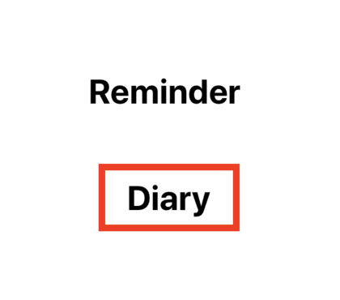
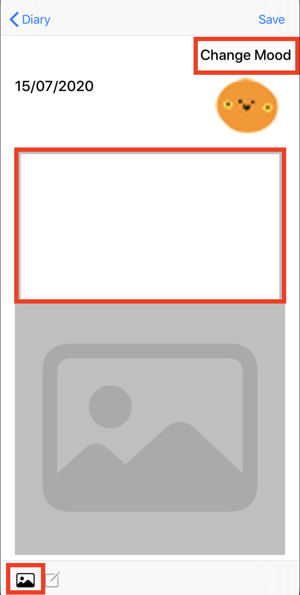
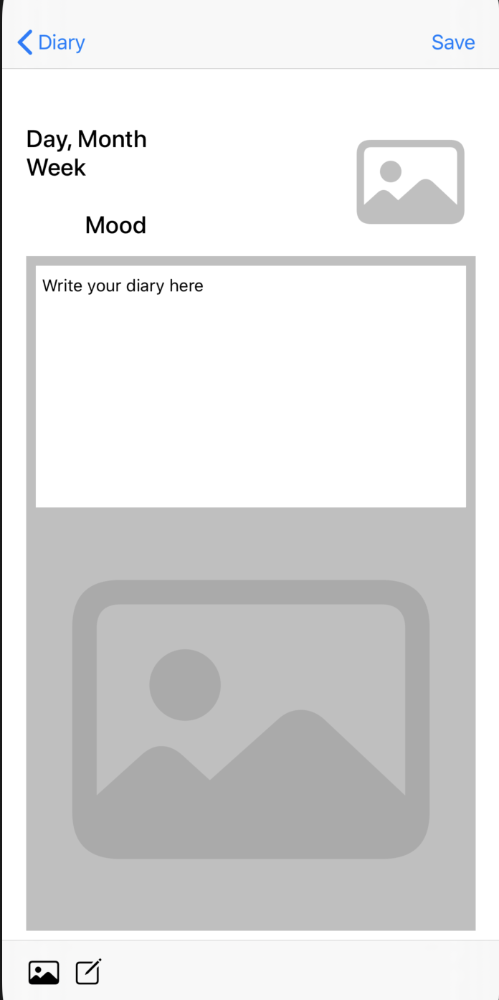

## Diary ： A simple diary to add text and pictures.

_The link to download the XCode/Swift_

https://swift.org/download/#releases

### Steps to install XCode (For macOS-Catalina version 10.15.4)

1. Download the latest version of XCode 11.5
   From: https://swift.org/download/#releases
   or from App Store
2. Follow the steps to install the XCode into application
3. Create a new folder
4. Open your terminal -> go the the folder
5. using command to clone the project: ```git clone git@github.com:jq5/MISL-SOC-20-Tingting.git```
6. After clone, open the folder name "ProjectDemo - MyProject" 
7. Below explain how to run project "MyProject"

### Steps to run XCode project

1. Open ***MyProject.xcworkspace*** as image below. XCode will open the project.


2.  On the top left corner, select ***iPhone 11 Pro Max***, then click the run button.


3. Wait until the simulator pop up, it might take few minutes, then you can see the homepage, click the Diary button on the page.


4. If it doesn't work or no calendar on the diary homepage, open the terminal and follow the steps to install CocoaPods for running the calendar in the project.

https://cocoapods.org

5. In the upper right corner is the **+** button to add a new diary. Click on it to enter the interface to add a new diary. (It will be deleted later. The desired function is to click the date on the calendar, an inquiry box will pop up and the user can select the mood of the day. After selecting the date, it will jump to the diary writing interface.)


6. On the add diary page, it has *date*, *change mood name*, *mood image*, *write diary* and *add iamge* as image shown below. (click save button, back to diary homepage, the date of the day displays the previous emoji selected by the user, update later)


### Future Work

1. Improve the diary interface     (0.5 - 1 week)
2. Realize **Diary** functions - e.g. Add image function, input text function     (2 weeks)
3. Improve Diary, test and fix bugs     (0.5 - 1 week)

### Reference

*1. https://www.youtube.com/watch?v=UYYEdtel5GQ*
*2. http://cocoadocs.org/docsets/FSCalendar/0.9.0/*
