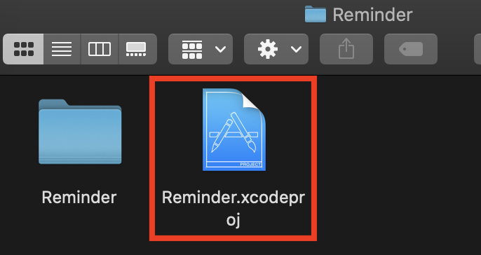
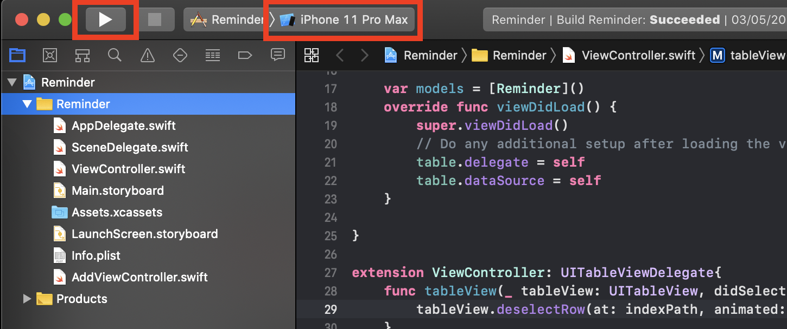
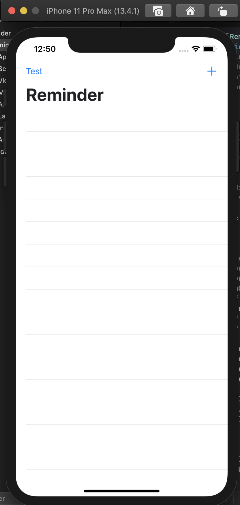
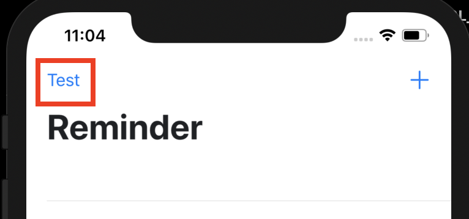
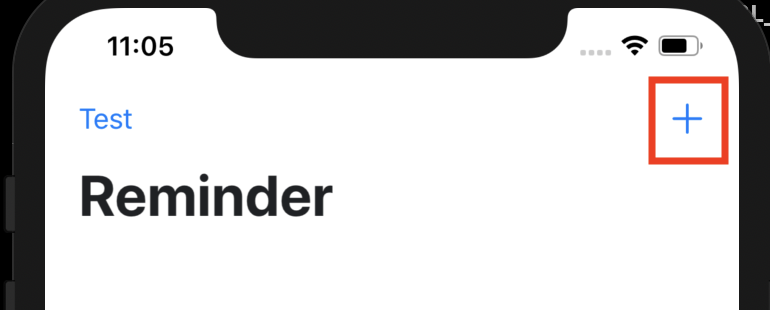
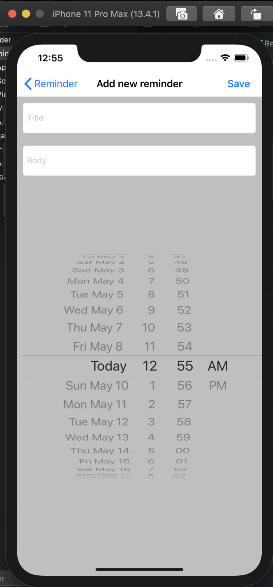
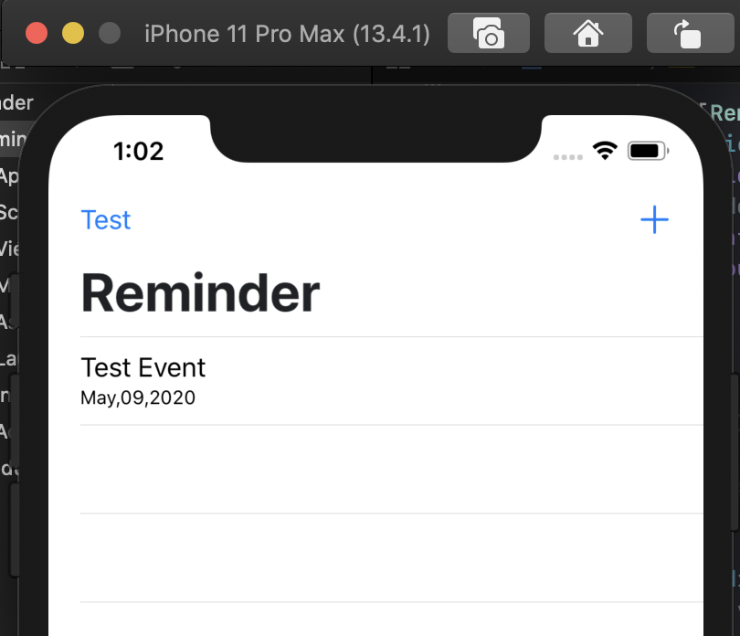

## Create a simple Reminder （not using CoreData）

_The link to download the XCode/Swift_

https://swift.org/download/#releases

### Steps to install XCode (For macOS-Catalina version 10.15.4)

1. Download the latest version of XCode 11.4.1
   From: https://swift.org/download/#releases
   or from App Store
2. Follow the steps to install the XCode into application
3. Create a new folder
4. Open your terminal -> go the the folder
5. using command to clone the project: ```git clone git@github.com:jq5/MISL-SOC-20-Tingting.git```
6. After clone, open the folder name "ProjectDemo"
7. Below to explain how to run a project "Reminder"

### Steps to run XCode project

1. Open ***Reminder.xcodeproj*** as image below. XCode then will open the project.


2.  On the top left corner, select ***iPhone 11 Pro Max***, then click the run button.


3. Wait until the simulator pop up, it might take few minutes, then you can see the homepage of Reminder.


4. On the main page, in the upper left is a test button which is created to test whether the notification is working properly, it will be deleted later.


5. In the upper right corner is the **+** button to add a new reminder. Click on it to enter the interface to add a new event.


6. On the add event page, it has *title*, *body* and *time* as image shown below, you can have a try to edit all of them.


7. Back to the home page, it shows all the events as image below.


### Reference

https://www.youtube.com/watch?v=E6Cw5WLDe-U

Due to the version update encountered a difference between the Scene Delegate and the App Delegate while trying to create a search bar

English website, talking about the concept:
https://learnappmaking.com/scene-delegate-app-delegate-xcode-11-ios-13/

Chinese website, reference code:
https://www.jianshu.com/p/82acfae8cc44