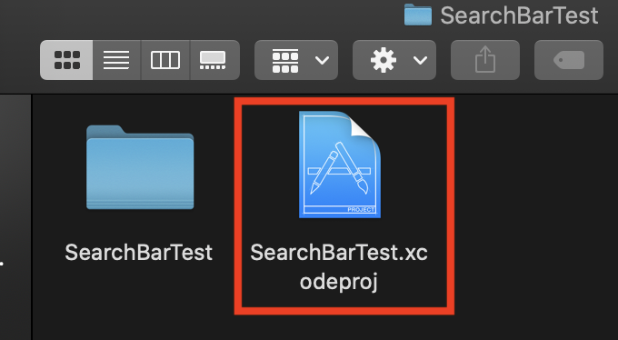
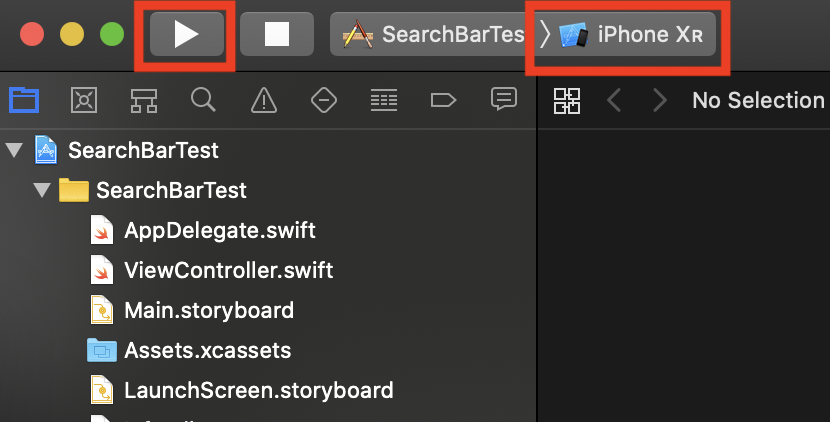
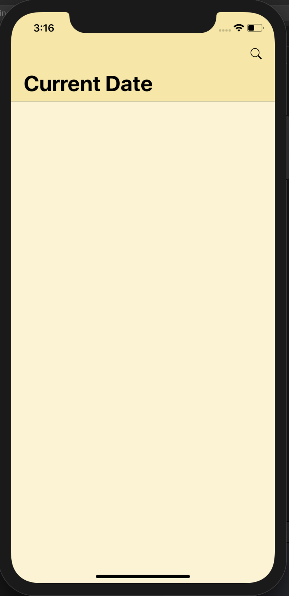
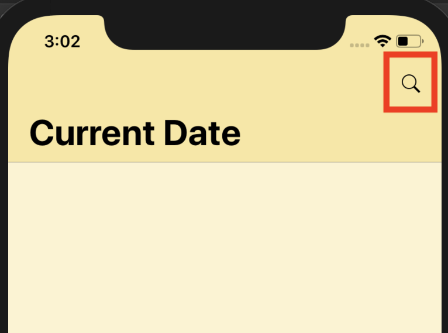
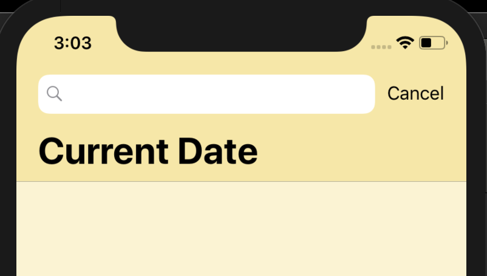

## Create a search bar for content search

_The link to download the XCode/Swift_

https://swift.org/download/#releases

### Steps to install XCode (For macOS-Catalina version 10.15.4)

1. Download the version of XCode 10.2.1
   From: https://swift.org/download/#releases
2. Follow the steps to install the XCode into application
3. Create a new folder
4. Open your terminal -> go the the folder
5. using command to clone the project: ```git clone git@github.com:jq5/MISL-SOC-20-Tingting.git```
6. After clone, open the folder name "Version10.2.1"
7. Below to explain how to run "SearchBarTest"

### Steps to run XCode project

1. Open ***SearchBarTest.xcodeproj*** as image below, XCode then will open the project.


2.  On the top left corner, select ***iPhone Xr***, then click the run button.


3. Wait untill the simulator pop up, it might take few minutes, then you can see the homepage of SearchBarTest.


4. On the home page, displays the current date and a search icon.


5. When the search icon is clicked, the search box is displayed and can enter the content what you want to search. Click cancel to cancel the current action.



### Future Work

1. Try to display the current date

### Reference

https://www.youtube.com/watch?v=m56ff75tZyI

### Problems encountered

1. Can not change the font size of navigationitem.title

Possible solution after research, some of the search methods are basically the same but it doesn't work. It's the design part, solve it later.
https://stackoverflow.com/questions/39438606/change-navigation-bar-title-font-swift
https://stackoverflow.com/questions/19791762/ios-change-navigation-bar-title-font-and-color

The problem might be here：
navigationItem.title = "Current Date"

Try this way to change the font size based on the research:
navigationItem.title = "Current Date"
navigationController?.navigationBar.titleTextAttributes = [NSAttributedString.Key.font: UIFont.systemFont(ofSize: 20)]
